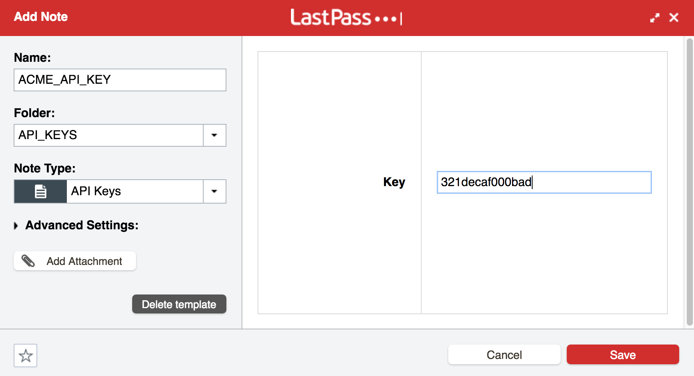

# Bash Functions for LastPass

Basic configuration and use. (or read the [longer version](longer.md))

## Configuration

1. **Install `lpass`**, the LastPass command line interface. See installation instructions in its [README file](https://github.com/lastpass/lastpass-cli/blob/master/README.md).

2. In LastPass:

    * Create an **new folder called API_KEYS**
    * Create a new **secure note template with a field called `Key`**. It's pretty simple to do, but LastPass provides [instructions for creating note templates](https://blog.lastpass.com/2016/07/diy-with-our-custom-secure-note-templates.html/) if you need more help.

3. Store your secrets in this new LastPass folder using this template.

4. Add this to your `.bashrc` or `.bash_profile`:

        # Use the email address associated with your LastPass account
        export LASTPASS_EMAIL="me@example.com"
        
        if type lpass 2>&1 >/dev/null && [[ -f $HOME/.lpassfunctions ]]
        then
            . $HOME/.lpassfunctions
        fi

## Using

Set environment variables from LastPass values like this:

    set_env_var_from_lastpass ACME_KEY_ID
    $ echo $ACME_KEY_ID
    321decaf000bad

## Cheat Sheet for Data Entry

