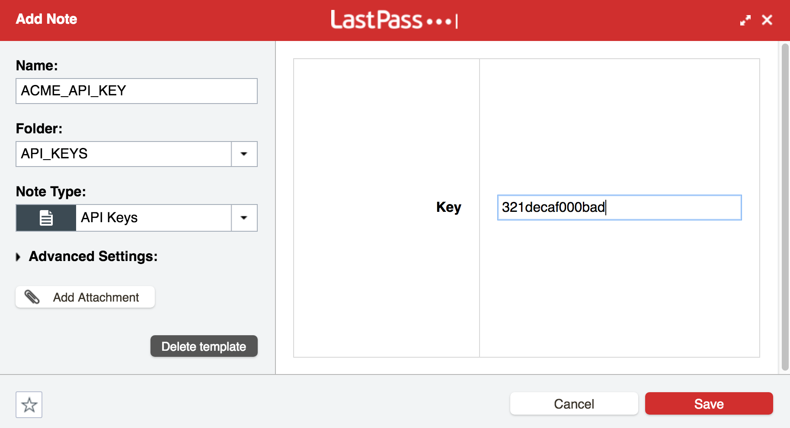

# Bash Functions for LastPass

I created these functions out of a desire to consolidate sensitive data like API keys into LastPass. This replaces my habit of putting secret information into my dotfiles.

After making some LastPass configuration changes and loading the file, you can set an environment variable like this:

    set_env_var_from_lastpass AWS_ACCESS_KEY_ID

## Set Up for LastPass

These functions assume two things in your LastPass account:

Create an **new folder called API_KEYS**. If you need to make it something else, you can override this by setting the `LASTPASS_KEY_FOLDER` environment variable with the name of the folder holding your keys.

Create a new **secure note template**. LastPass provides templates for secure notes to give some consistency and structure to notes. LastPass comes with templates for storing information like credit card numbers, server information, bank accounts and others. I took advantage of the consistency offered by custom note templates and use a template called "API Keys".

LastPass provides [instructions for creating note templates](https://blog.lastpass.com/2016/07/diy-with-our-custom-secure-note-templates.html/). The one assumption that my functions make is that your note has a field called "Key".

## Configuration in bash

First, install `lpass` the LastPass command line interface. See installation instructions in its [README file](https://github.com/lastpass/lastpass-cli/blob/master/README.md).

Add this to your `.bashrc`/`.bash_profile`:

    # Use the email address associated with your LastPass account
    export LASTPASS_EMAIL="me@example.com"
    
    if type lpass 2>&1 >/dev/null && [[ -f $HOME/.lpassfunctions ]]
    then
        . $HOME/.lpassfunctions
    fi

## Entering Data & Using

Once you've set up the folder and the note template, enter your secrets. Entry looks like this:

With that set, you can set your `ACME_API_KEY` in your environment without storing sensitive
data in your .bashrc

    $ set_env_var_from_lastpass ACME_KEY_ID
    $ echo $ACME_KEY_ID
    321decaf000bad
or

    $ connect-to-acme-server --api-key $ACME_KEY_ID
